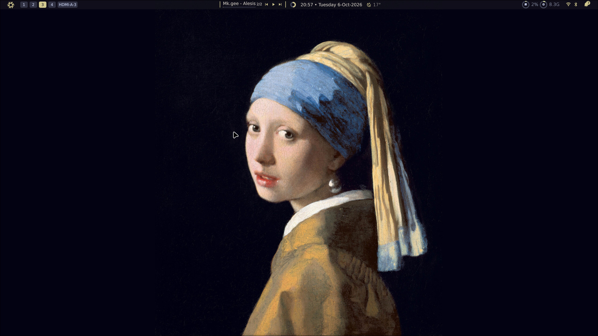

# sol-shell



A desktop shell for [Hyprland](https://hyprland.org): a status bar with popups,
notifications and a wallpaper on every monitor, built with
[Quickshell](https://quickshell.org) (QML). Install it as a flake input on NixOS, pick
a theme, and it also colors your other programs. The code is commented throughout to
explain *why* it is the way it is, which makes it easy to change.

What you get, on every monitor:

- **Wallpaper**: your picture, or the bundled default.
- **Status bar** with
  - a power menu (shut down, restart, log out, each needing a second click to
    confirm) and a settings page to pick a **theme** and a **wallpaper**
  - Hyprland workspaces
  - media controls for whatever is playing (title, progress bar, previous,
    play/pause, next, click-to-seek, switching between players)
  - a volume ring (scroll to change, middle-click to mute, click for a mixer:
    volume sliders, the list of output devices to switch between, microphone)
  - the clock with the **temperature** next to it; click either for a **calendar**
    (month view with week numbers, scroll to change month, click the month name
    to go back to today) and the weather: conditions now, high and low, feels
    like, humidity, and a **5-day forecast** (conditions, high, low, chance of rain).
    The place is set in `~/.config/quickshell/weather-location.json`
    (see below)
  - CPU and memory rings; click either for a small **task manager** (like htop and
    btop in miniature): CPU total, temperature and a bar per thread, load and
    uptime, memory in detail, every graphics card (use, memory, temperature,
    power) and the busiest programs by CPU or by memory
  - a Wi-Fi and Bluetooth popup (switches, network list with password prompt,
    paired devices)
- **Notifications**: the shell is the notification daemon, so apps (a browser,
  chat apps, `notify-send`) show up as cards in the top-right corner of the
  monitor you are using. They time out by themselves (critical ones stay until
  dismissed), pause while the mouse is over them, and a click dismisses them.
  A bell in the bar (with a badge for unread ones) opens the history, newest
  first, and has a **do not disturb** switch: while on, nothing pops up (critical
  ones still do) but everything is still recorded. Middle-click the bell to
  toggle do not disturb.
- **Messages from the shell itself**: when something you did fails, the shell
  says so in the same corner, as a red card: a wrong Wi-Fi password (the
  network's row says so too, and the password box opens again), a Bluetooth
  device that does not connect, a power action that is refused. They also go in
  the notification history and ignore do not disturb, because they answer what
  you just did.

## Requirements

- Quickshell **0.3.0** (developed and tested on 0.3.0 with Qt 6.11)
- **Hyprland**: workspaces and "log out" use it
- **NetworkManager** for Wi-Fi (the only network backend Quickshell supports)
- **BlueZ** for Bluetooth, **PipeWire** for volume
- a media player that supports MPRIS (Spotify, browsers, mpv, ...)
- the fonts **Material Design Icons** and **Symbols Nerd Font**
- optional: `lspci` (pciutils) for the name of an AMD graphics card, `nvidia-smi` for NVIDIA ones

### On NixOS (flake)

Add sol-shell as a flake input and import its module:

```nix
# flake.nix
inputs.sol-shell.url = "github:YOUR-NAME/sol-shell"; # TODO: set the real repository before the first release

# in your NixOS configuration
imports = [ inputs.sol-shell.nixosModules.default ];
sol-shell.enable = true;
# optional: Wofi, Thunar and Dolphin, the programs whose colors the shell writes
sol-shell.themedApps.enable = true;
```

The module installs the `sol-shell` command, which is the shell itself, built from
your own nixpkgs (the Quickshell and Qt in your system), and everything around it:
`pciutils`, the two fonts and, optionally, the programs the shell themes. It also
switches on Hyprland, NetworkManager, Bluetooth and PipeWire (with `mkDefault`, so
settings you already have win). Then start the shell from Hyprland with
`exec-once = sol-shell`.

The same module works inside home-manager (`home-manager.users.<you>`) when you import
it by file (`imports = [ "${inputs.sol-shell}/quickshell.nix" ];`): it then installs the
packages and fonts for that user only, and the services belong to the system, so they
must already be enabled in your NixOS configuration.

Settings are kept in `~/.local/state/sol-shell/`, so updating the flake input does
not lose them.

Quickshell is wrapped so that it can read **webp** pictures: the Quickshell that
nixpkgs builds cannot (a webp wallpaper fails to load and the bundled one is shown
instead) because Qt keeps webp in a separate plugin, `qtimageformats`. On another
distribution, install that plugin too if you want webp wallpapers.

## Running it

```bash
sol-shell
```

starts the shell (put it in Hyprland's `exec-once`). `sol-shell ipc ...` and
`sol-shell log` talk to the running shell, wherever it is installed. To see warnings
and errors:

```bash
sol-shell log
```

From a checkout (not installed) run `bin/sol-shell`, or `quickshell -p <the folder>`.
(There is also a Zed task in `.zed/tasks.json`.) Quickshell reloads the shell by
itself whenever you save a file.

## Settings

The theme, the transparency and the wallpaper are chosen in the power menu: click the
NixOS icon, then **Settings**. They are saved to
`~/.local/state/sol-shell/settings.json`, outside this folder, so
they are never committed. The file looks like this and can be edited by hand:

```json
{
    "theme": "solliom",
    "backgroundOpacity": 0.8,
    "wallpaper": ""
}
```

- Themes: `solliom` (default), `catppuccin`, `gruvbox`, `nord`, `dracula`,
  `tokyonight`, `rosepine`, `everforest` and `catppuccin-latte` (a light theme).
- The picker lists the images in `~/Pictures/Wallpapers` (jpg, jpeg, png, webp; webp
  needs the Qt image plugin, see "On NixOS").
  An empty wallpaper (`""`) means the bundled painting, `wallpaper/Meisje_met_de_parel.jpg`
  (public domain, see `wallpaper/CREDITS.md`), which is also used if your own picture is
  missing or broken. It is shown whole on a dark background; your own pictures fill the
  screen and are cropped to fit. Pictures up to 1440 pixels high are supported; a
  bigger one works but takes more memory than it needs.
- Transparency (`backgroundOpacity`, 0.3 to 1.0 on the slider, default 0.8): how
  see-through the bar is. The popups are half as see-through (80% gives 90%), and the
  programs the shell themes (Wofi, Thunar, Zen) use the same value; they read it when
  they start. 1.0 is fully solid. See "Blurry backgrounds" for the blur.

## Weather

The temperature in the bar and the weather and 5-day forecast in the calendar popup come from
[Open-Meteo](https://open-meteo.com) (free, no account or key; the shell needs
internet for it). The place is read from a small file that you write yourself:

```json
{ "latitude": 51.9225, "longitude": 4.47917, "locationName": "Rotterdam" }
```

at `~/.config/quickshell/weather-location.json`. The file is watched: change the
place and the weather follows within seconds, without a restart. It is refreshed
every 15 minutes. Without the file (or with a broken one) the bar simply shows no
temperature and the popup says where to put it. If a refresh fails the last numbers
stay, the icon dims, and the popup says they may be out of date. Temperatures are
in degrees Celsius.

`sol-shell ipc call weather summary` prints what the
shell currently knows, and `call weather refresh` fetches again at once.

## Controlling it from outside

The shell listens for commands, so a Hyprland keybind can drive it. For example,
to toggle do not disturb (the other commands are `clear`, `count`, `unread`,
`list` and `dnd`; `sol-shell ipc show` lists everything. `sysmon summary`
prints the task manager numbers as text; it exists once the popup has been opened,
and shows "inactive" while the popup is closed):

```bash
sol-shell ipc call notifications toggleDoNotDisturb
```

Scripts can show a message in the shell too (a red card for `error`, a plain one
for `info`), and `count` says how many are on screen:

```bash
sol-shell ipc call messages error "Backup failed" "The disk is full"
```

## Theming other programs

Whenever the theme changes (and at startup), `export/ThemeExporter.qml` fills in
the templates in `export/` with the theme's colors and writes the result to
`~/.local/state/theme/`. A template is the target file with `{{name}}`
placeholders (`{{background}}`, `{{accent}}`, ...; the list is `values` in
`ThemeExporter.qml`).

| Program | Template | Output | Use it with |
|---|---|---|---|
| Wofi | `export/wofi.css.tpl` | `~/.local/state/theme/wofi.css` | `wofi --show drun --style ~/.local/state/theme/wofi.css` |
| Dolphin | `export/kdeglobals.tpl` | `~/.local/state/theme/kdeglobals` | two links, see below |
| Thunar (GTK3 programs) | `export/gtk.css.tpl` | `~/.local/state/theme/gtk.css` | one link, see below |
| Zen browser | `export/zen-userChrome.css.tpl`, `zen-userContent.css.tpl`, `zen-user.js.tpl` | `zen-*` in `~/.local/state/theme/` | `export/zen-setup.sh`, see below |

Write the files again by hand with
`sol-shell ipc call themeExport run`.

**Dolphin** (and other KDE programs) read their colors from `kdeglobals` and from
a named color scheme. Dolphin does not need Plasma for this, but it needs two
links, made once (the shell does not create files outside its own folders):

```bash
ln -s ~/.local/state/theme/kdeglobals ~/.config/kdeglobals
mkdir -p ~/.local/share/color-schemes
ln -s ~/.local/state/theme/kdeglobals ~/.local/share/color-schemes/SolShell.colors
```

A Dolphin that is already running only half follows a theme change (the file
area updates, the side panel does not), so restart it after switching theme. A
new window of a running Dolphin uses the colors that process started with.

**Thunar** and other GTK3 programs read `~/.config/gtk-3.0/gtk.css`. One link,
made once:

```bash
ln -s ~/.local/state/theme/gtk.css ~/.config/gtk-3.0/gtk.css
```

GTK's built-in Adwaita theme ignores redefined named colors (measured), so the
template colors each kind of widget with an explicit rule. A program picks the
theme up when it starts: restart Thunar (`thunar -q`) after switching theme.
Folder icons stay blue: they belong to the icon theme.

**Zen browser** reads three files from its profile. Run the setup script once,
with Zen closed:

```bash
bash export/zen-setup.sh   # from a checkout
# installed with Nix: the same script inside the package
bash "$(dirname "$(readlink -f "$(command -v sol-shell)")")/../share/sol-shell/export/zen-setup.sh"
```

It finds the default profile in `~/.config/zen/profiles.ini` and links:

| Profile file | Generated from | What it does |
|---|---|---|
| `chrome/userChrome.css` | `zen-userChrome.css.tpl` | colors Zen's own interface |
| `chrome/userContent.css` | `zen-userContent.css.tpl` | colors Zen's own pages (settings, `about:`) |
| `user.js` | `zen-user.js.tpl` | turns on custom stylesheets (off by default), and sets the dark/light that websites and the toolbar follow |

Websites keep their own design, but they are told the theme is dark or light
(`prefers-color-scheme`), so sites that support both follow it. Whether a theme
counts as dark or light is judged from its background color.

The script never overwrites a real file: if your `user.js` has your own
settings in it, it leaves it alone and says so (then move it away and run the
script again, or copy the lines from `zen-user.js.tpl` into it yourself, though
then the dark/light will not follow the theme). It refuses to run while the
profile is open. Zen reads these files only at startup, so restart it after
switching theme.

### Light or dark for everything else

Programs whose colors the shell cannot change, such as Claude Desktop (its colors come
from the website) and other Electron or GTK4 programs, can still follow the theme's
light or dark side. The exporter writes `prefer-dark` or `prefer-light` to
`/org/gnome/desktop/interface/color-scheme` (with `dconf`) every time the theme changes,
and the desktop settings portal passes that on. Claude Desktop must be on its default
`userThemeMode: "system"`; restart it after switching if it does not follow at once.
This is the one setting here that is not a file under `~/.local/state/theme`: it changes
your desktop-wide preference.

### Blurry backgrounds

Wofi, Thunar and Zen have see-through backgrounds. How see-through is the
`backgroundOpacity` setting (the Transparency slider in the settings page, or `settings.json`; default 0.8; 1.0
turns it off). The blur itself is done by Hyprland, which blurs whatever shows
through a translucent window. Two things are needed in `~/.config/hypr/hyprland.lua`:

- blur on and strong enough to see: `decoration.blur` with `enabled = true`,
  for example `size = 8, passes = 3` (the default `size 3, passes 1` is barely visible);
- Wofi is a layer surface, so it needs its own rule (windows like Thunar and Zen
  do not):

```lua
hl.layer_rule({
    name         = "blur-wofi",
    match        = { namespace = "^wofi$" },
    blur         = true,
    ignore_alpha = 0.1,
})
```

In Zen only the sidebar and toolbar are see-through; the page itself is not, as
websites paint their own background. Zen needs its window transparency switched
on, which the generated `user.js` does (`zen.widget.linux.transparency`).
In templates, `{{backgroundAlpha}}` (and `{{windowAlpha}}`, ...) is a color with
that opacity: `rgba(17, 17, 27, 0.80)`.

## How it fits together

```
shell.qml            entry point: a wallpaper and a bar on every monitor
export/              templates and the exporter that themes other programs (wofi, dolphin, thunar, zen)
wallpaper/           the wallpaper window and the bundled default picture
flake.nix            the flake: the package, the NixOS module and the VM test
package.nix          builds the shell into the Nix store (the `sol-shell` command)
quickshell.nix       NixOS / home-manager module with everything the shell needs
bin/sol-shell        the command line: start, `ipc` and `log`
tests/vm.nix         NixOS VM test: fresh user, Hyprland, the shell from the flake
statusbar/           the bar and everything in it
  components/          the bar's parts (media, clock, workspaces, popups, ...)
    indicators/        CPU, memory, volume and weather indicators
    calendar/          the calendar popup of the clock
    settings/          the settings page of the power menu
singletons/          shared state and services (one instance each)
  themes/              the color palettes
utils/               small reusable pieces (ring, switch, spacer)
```

The main idea is that **services hold state and the UI only displays it**:

- A *service* in `singletons/` (`MediaService`, `NetworkService`,
  `AudioService`, ...) reads the system and exposes plain properties
  (`MediaService.title`) and functions (`MediaService.next()`).
- A *component* in `statusbar/` binds to those properties and calls those
  functions. It never talks to the system directly.
- Settings and themes work the same way: the picker only writes
  `Settings.themeName`, and `Theme` (a binding on it) recolors everything.

### Building blocks worth knowing

- **`BarPopup`** is the popup that hangs below a bar item. Put your contents
  inside it and call `popup.toggle()` from the icon's click handler. The
  contents are only built while it is open.
- **`ListRow`** is a clickable line with an icon, a title and a status line,
  used for devices, networks and power actions.
- **`StatusRing`** draws a ring from a 0.0 to 1.0 value.

### Adding a theme

1. Copy `singletons/themes/Gruvbox.qml`, rename it and change the colors.
2. Add it to the `themes` list and add a property for it in
   `singletons/Theme.qml`.

It then shows up in the settings page.

## Known limits

- Hyprland only (workspace switching and log out use `hyprctl`/its IPC).
- The calendar always starts the week on Monday (ISO week numbers); the weather
  is in Celsius and the weather descriptions are in English.
- Only the first Wi-Fi device is handled; wired connections are not shown.
- No lock or suspend entry in the power menu yet.
- The task manager shows NVIDIA graphics cards (through `nvidia-smi`) and AMD ones
  (through `/sys`); Intel ones are not shown yet.
- Notifications: no action buttons yet, and the history lives in memory only (it
  is empty again after the shell restarts). Only one program can be the
  notification daemon, so do not run mako, dunst or similar next to this shell.
- Failure messages depend on what NetworkManager and BlueZ report. A wrong Wi-Fi
  password is recognized from NetworkManager's reasons (no secrets, authentication
  timeout, client failure); a Bluetooth device that never answers is reported
  after 20 seconds. A Wi-Fi network that the shell saved from a typed password
  is forgotten again if that password fails, so you are asked once more.
- Typing a Wi-Fi password relies on the popup's focus grab (`grabFocus` in
  `BarPopup`) to give it the keyboard. If typing does nothing on your setup,
  look there first.
- Quickshell 0.3.0 can crash in its live reload when many files change at the
  same moment (for example a script editing dozens of files). It restarts
  itself, so this only matters while developing.

## Tests and license

`nix build .#checks.x86_64-linux.vm -L` boots a NixOS machine with a fresh user and
Hyprland, starts the shell from the flake and checks that it stays up with no errors
in its log, answers `sol-shell ipc`, saves settings, and draws the clock (read back
with OCR). It cannot judge how the bar looks.

The code is under the MIT license (`LICENSE`). The default wallpaper is a public
domain painting with its own credit in `wallpaper/CREDITS.md`.
